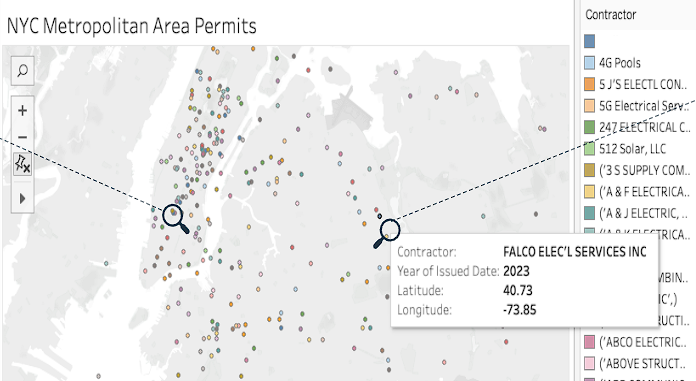
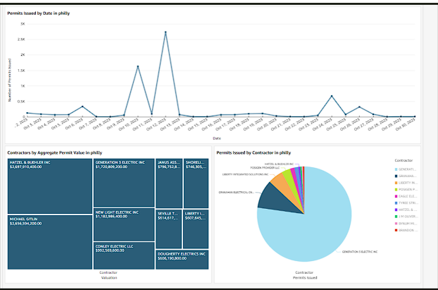
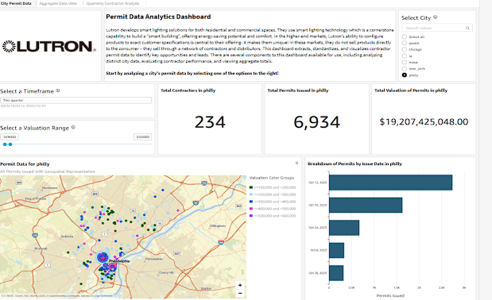
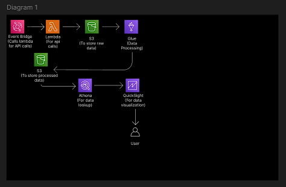
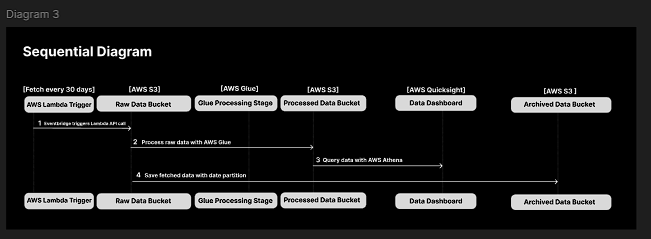

# Lutron Permit Capstone
The Lutron Permit Capstone is a cloud solution that helps Lutron identify valuable contractors and building projects through a visual dashboard.
Presentation Link: https://docs.google.com/presentation/d/16lxT6okFA8GXUVGyKdgW9Wfgi931MiRZFc_sz9_-QRE/edit#slide=id.g1ec88684110_0_6
## Demo:
#### City Dashboard NYC
This is the visual representation of the city dashboard that showcases the geographical distribution of building projects.

#### Data Dashboard
This dashboard provides an overview of the collected data, enabling users to quickly analyze key metrics.

#### Graph and Chart Dashboard
Displays various graphs and charts representing the project's performance and insights.

#### Main Page
The main page of the Lutron Permit Capstone application, serving as the starting point for users.

## Diagrams:
#### Cloud Architecture Diagram
A diagram illustrating the architecture of the cloud infrastructure powering the solution.

#### Sequential Diagram
Depicts the sequence of events and processes for handling the data through the system.

## Run Ingestion Scripts
- Run all scripts: ./run.sh --ingest
- Run a specific script: ./run.sh --ingest <get/strip/combine>

## Run Unit Tests
- Test strip script: ./run.sh --test strip
- Test combine script: ./run.sh --test combine

## Dependencies
- Install dependencies: ./run.sh --install
- Save dependencies: ./run.sh --reqs

## Delete Data Directory
./run.sh --clean

## NOTE: All AWS Lambda functions must be compiled on a Linux-Machine (Either Docker or machine) to be deployed properly ##
## Run Docker File  
- Build docker: docker build -t lutron .
- Run docker: docker run --privileged --rm -v /c/Users/Wilso/Desktop/lutron:/root --name lutrondev -it lutron

## Get Lambda get_data_deploy zip file to deploy to AWS
- docker cp lutrondev:get_data_deploy.zip C:\Users\Wilso\Desktop\lutron\Lutron-PermitDataAnalytics

## Afterwards drag get_data_deploy.zip folder into s3 bucket and refer to the s3 URI to call lambda function.
## Handler
